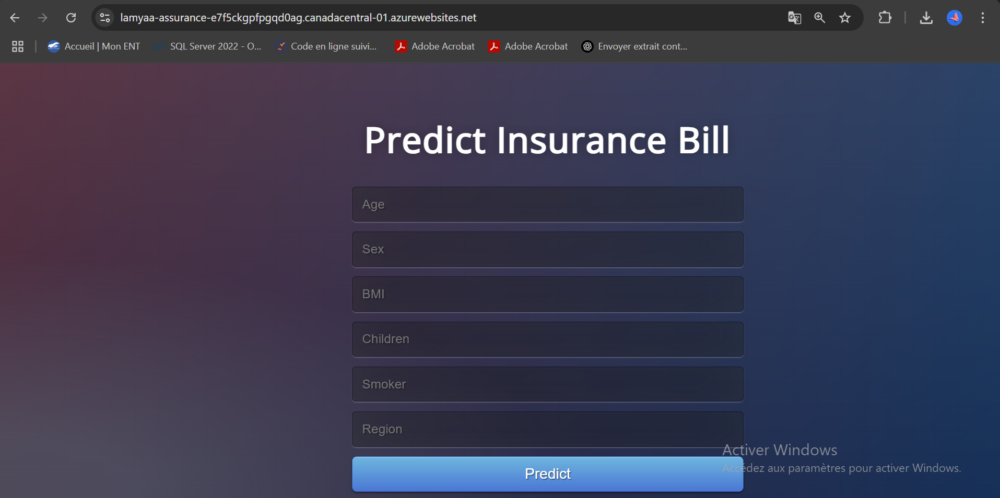
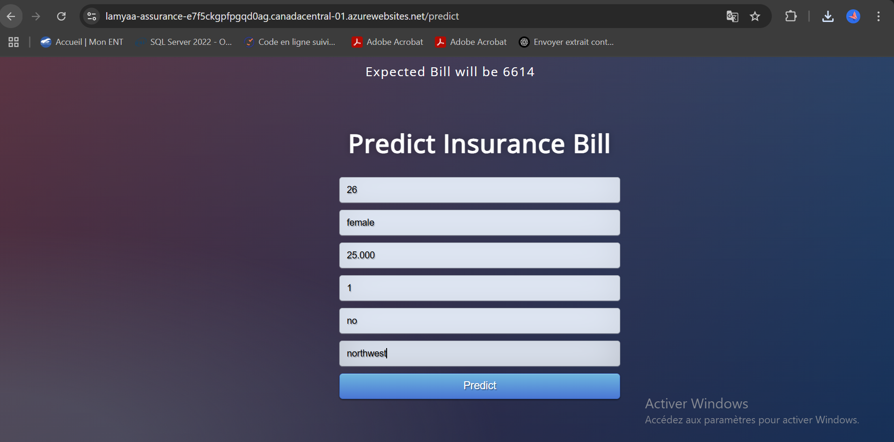

# Projet Prediction Charges ML

Ce projet est une application web permettant de prédire les charges à partir de données spécifiques en utilisant le Machine Learning.

## 📌 Description

L'application est développée en **Python** avec **Flask** pour l'interface web et **PyCaret** pour l'entraînement et la prédiction du modèle.

- **Développement** : Flask pour le backend et HTML/CSS pour l'affichage.
- **Machine Learning** : PyCaret pour l'entraînement et la sélection du meilleur modèle.
- **Docker** : Conteneurisation de l'application pour faciliter son déploiement.
- **Azure Machine Learning** : Déploiement du modèle sur Azure.

## 🛠️ Installation et Exécution

### 1️⃣ Prérequis
- Python 3.9+
- pip et virtualenv
- Docker (optionnel pour l’exécution en conteneur)

### 2️⃣ Installation
Cloner le dépôt :
```bash
git clone https://github.com/LamyaaER/Projet-Prediction-Charges-ML.git
cd Projet-Prediction-Charges-ML
```
Créer un environnement virtuel et installer les dépendances :
```bash
python -m venv venv
source venv/bin/activate  # Sur Mac/Linux
venv\Scripts\activate  # Sur Windows
pip install -r requirements.txt
```

### 3️⃣ Exécution
Lancer l’application :
```bash
python app.py
```
L’application sera accessible sur `http://127.0.0.1:5000/`.

## 📦 Utilisation avec Docker
Build et exécution du conteneur Docker :
```bash
docker build -t prediction-charges .
docker run -p 5000:5000 prediction-charges
```

## 🚀 Déploiement sur Azure Machine Learning
1. Création d’un workspace sur Azure ML.
2. Enregistrement du modèle PyCaret.
3. Déploiement sous forme de service web.
4. Test avec une requête API.

## 📸 Captures d'écran




## 📜 Licence
Ce projet est sous licence MIT.

---
**Auteur** : [Lamyaa ER-RECHAKI](https://github.com/LamyaaER)

